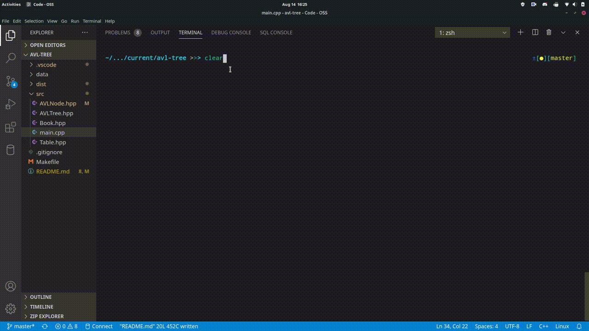

# AVL-TREE  

## DESCRIPTION
An AVL tree that is constructed around reading a datafile on books.  
An AVL tree organizes new inputs in a sorted order and automatically balances afterwards.  
Since an AVL tree is ordered, it is searchable in O(LogN) time.  

## USAGE  
### See Makefile for build, run, and debug processes  
build:  
g++ src/* -o dist/avl.o -g

run:   
./dist/avl.o ./data/books.txt

debug:  
gdb dist/avl.o

## SOURCE  
### AVLNode.hpp